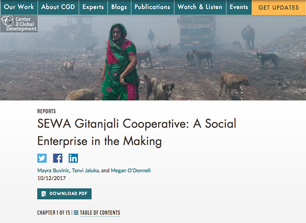
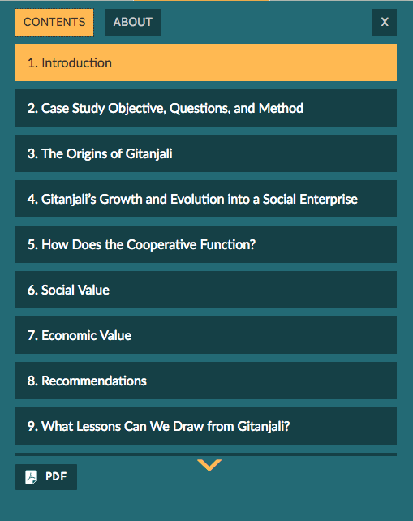
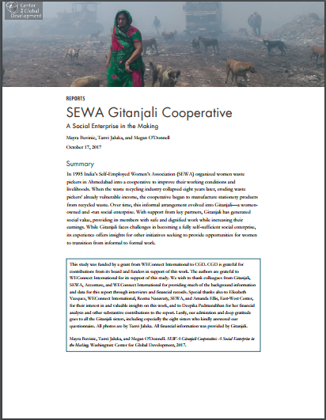

# Single Page App for Multichapter Reports

This app consists of a custom Drupal 7 module topped with an AngularJS single-page app for publishing multichapter reports. The Drupal module accomplishes two basic things:

* it makes sure the report is presented in the normal Drupal theme of the website
* it passes data to the front end for the Angular app to use

## Why?
Because the existing Drupal theme was designed for description pages that summarize the publication and link to its PDF, it was unable to meet the needs of digital-first publishing. This app allows content editors to create a complete multichapter publications using the CMS they're used, presents that reports as a rich, interactive experience for users, and allows editors to spin-off a print-ready PDF from the digital content.

